# Console MVC – 재고 관리 프로그램

## 시나리오

작은 상점의 재고를 콘솔에서 관리하는 프로그램을 만들어라. 사용자는 콘솔 메뉴를 통해 상품을 등록/수정/삭제하고, 입고/출고로 수량을 조정하며, 검색과 정렬, 간단한 통계(총 재고 수량, 총 재고 금액)를 확인할 수 있어야 한다. 프로그램은 **MVC 패턴**을 따라 Model-View-Controller로 역할을 분리해야 한다.

---

## 기능 요구사항

### 1) 상품 도메인

* 상품 속성

  * `id`: 문자열 (고유값, 예: `P-001`)
  * `name`: 문자열 (중복 가능하지만 빈 문자열 불가, 최대 50자)
  * `price`: 정수 (원 단위, 0 이상)
  * `quantity`: 정수 (0 이상)
  * `category`: 문자열 (예: “음료”, “과자”, “문구” 등, 빈 문자열 불가)
* 제약

  * `id`는 중복 불가
  * `price`, `quantity`는 음수 불가

### 2) 메뉴(콘솔)

```
[1] 상품 등록
[2] 상품 수정
[3] 상품 삭제
[4] 입고 (수량 증가)
[5] 출고 (수량 감소)
[6] 목록 보기 (정렬/필터 포함)
[7] 검색 (이름/카테고리/가격범위)
[8] 통계 (총 수량/총 금액/카테고리별 합계)
[9] 저장 및 종료
선택:
```

### 3) 세부 동작

#### [1] 상품 등록

* 입력: `id`, `name`, `price`, `quantity`, `category`
* 검증: `id` 중복 시 에러, 필수값 누락 시 에러, 숫자 범위 검증
* 성공 시 등록 및 메시지 출력

#### [2] 상품 수정

* 입력: `id`
* 존재 시 개별 필드 수정(Enter로 스킵 가능): `name`, `price`, `quantity`, `category`
* 검증 동일

#### [3] 상품 삭제

* 입력: `id`
* 존재 시 삭제, 없으면 에러

#### [4] 입고

* 입력: `id`, `amount`
* `amount > 0` 검증, 수량 증가

#### [5] 출고

* 입력: `id`, `amount`
* `amount > 0` 검증, 재고 부송 시 에러(`quantity - amount < 0` 불가)

#### [6] 목록 보기

* 정렬 옵션: `id | name | price | quantity` (오름차순 기본, `desc` 입력 시 내림차순)
* 필터 옵션(선택): `category=문구` 처럼 하나만 적용 (없어도 됨)
* 표 형태로 출력

#### [7] 검색

* 이름 포함 검색: 키워드 포함(대소문자 구분 X)
* 카테고리 정확 일치
* 가격 범위: `minPrice`, `maxPrice` 입력 (빈 값은 무제한)
* 결과 표 출력

#### [8] 통계

* 총 재고 수량: 모든 `quantity` 합
* 총 재고 금액: Σ(`price * quantity`)
* 카테고리별 합계: 수량/금액

#### [9] 저장 및 종료

* 현재 재고 목록을 `data/inventory.json`에 저장하고 종료
* 다음 실행 시 해당 파일을 로드해 이어서 사용

---

## 입출력 예시

### 예시 1 – 상품 등록 성공

```
[1] 상품 등록
ID: P-001
이름: 콜라 500ml
가격(원): 1500
수량: 10
카테고리: 음료
→ 등록 성공: P-001 (콜라 500ml)
```

### 예시 2 – 출고 실패(재고 부송)

```
[5] 출고
ID: P-001
출고 수량: 20
[에러] 재고 부송: 현재 수량 10, 요청 수량 20
```

### 예시 3 – 목록 보기(정렬 + 필터)

```
[6] 목록 보기
정렬 기준(id|name|price|quantity): price
내림차순(desc) 또는 Enter: desc
필터(예: category=음료) 또는 Enter: category=음료

ID      NAME           PRICE  QTY  CATEGORY
P-005   제로콜라 500ml  1800   15   음료
P-001   콜라 500ml      1500   10   음료
총 2개
```

### 예시 4 – 검색(이름 + 가격 범위)

```
[7] 검색
이름 키워드(Enter=건너뜨림): 콜라
카테고리(Enter=건너뜨림):
최소 가격(Enter=무제한): 1000
최대 가격(Enter=무제한): 1600

ID      NAME           PRICE  QTY  CATEGORY
P-001   콜라 500ml      1500   10   음료
총 1개
```

### 예시 5 – 통계

```
[8] 통계
총 수량: 100
총 금액: 153,000원
[카테고리별]
- 음료: 수량 40, 금액 60,000원
- 과자: 수량 30, 금액 45,000원
- 문구: 수량 30, 금액 48,000원
```

---

## 제약사항

* **아키텍처**: MVC 패턴 준수

  * **Model**: `Product`, `Inventory(Repository 역할 포함 가능)`
  * **View**: 콘솔 입출력 전달(`ConsoleView`)
  * **Controller**: 메뉴 흐름/명령 분기(`InventoryController`)
* **데이터 영소성**: JSON 파일(`data/inventory.json`) 로드/저장
* **에러 처리**: 사용자 입력 검증(필수값/범위/중복 등)과 예외 메시지 표준화
* **정렬/검색**: 정렬 기준과 검색 조건을 명확히 분리, 불변 데이터 복사 후 가공
* **테스트**: Model과 Service 레이어에 대한 단위 테스트(등록/수정/입고/출고/검색)

## 모델 목록
* Inventory
  * products
* Product
  * id
  * name
  * price
  * quantity
  * category

## 기능 목록(모델 기능)
* register
* edit
* remove
* add
* substitute
* list
* find
* stat

### 뷰 기능 목록
* printMenuAndInputChoice
* register
* edit
* delete
* receive
* ship
* list
* search
* statistic

### 컨트롤러 기능 목록


## flow chart
### 🧭 메인 루프 (Main Flow Overview)
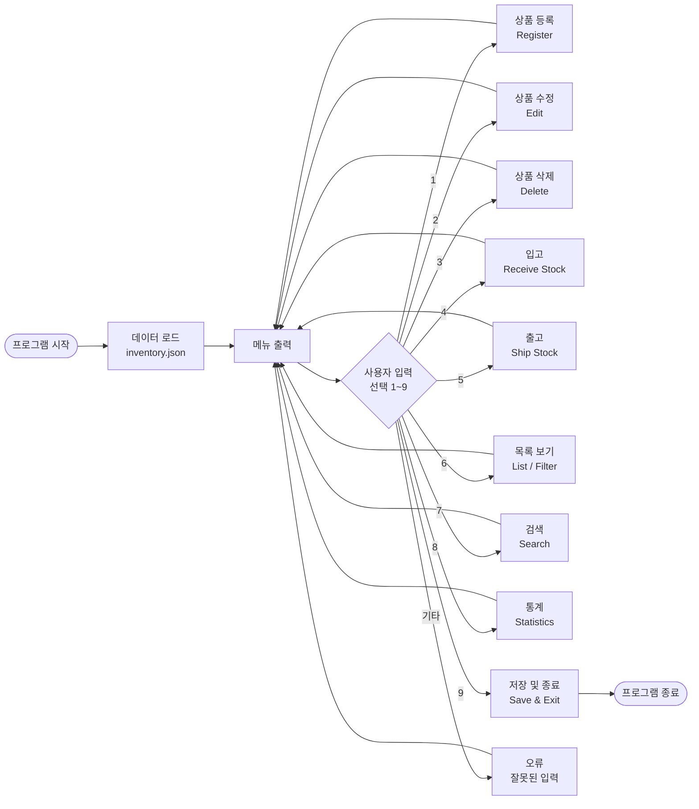


### 🧾 1️⃣ 상품 등록 (Register Product)
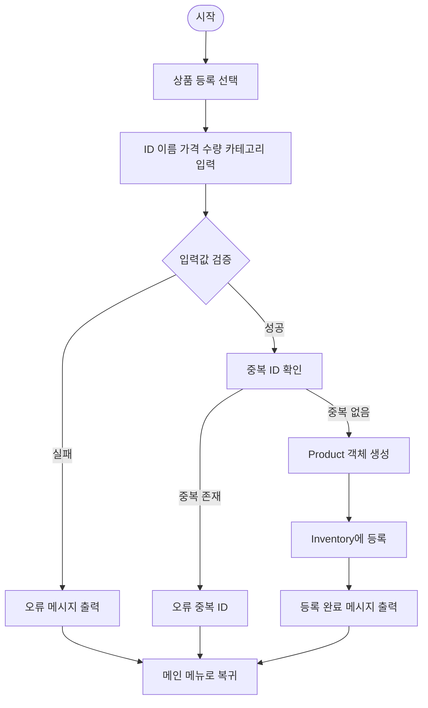
---
### 🧾 2️⃣ 상품 수정 (Edit Product)
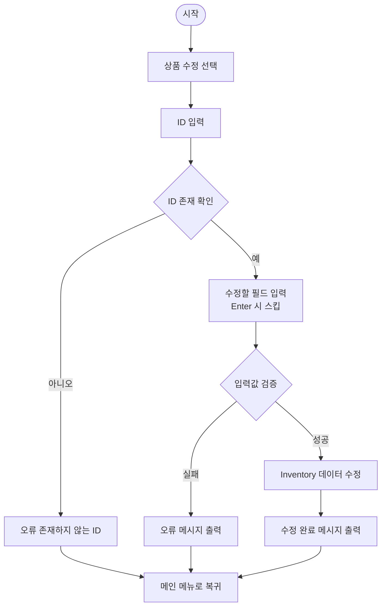
---

### 🧾 3️⃣ 상품 삭제 (Delete Product)
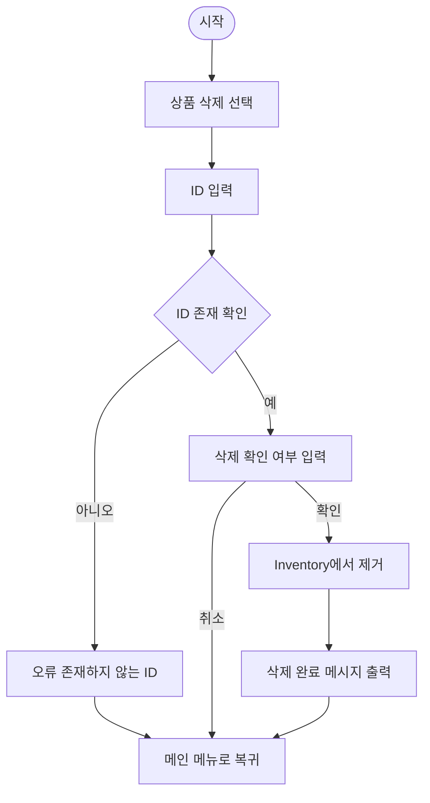

---

### 📦 4️⃣ 입고 (Receive / Add Stock)
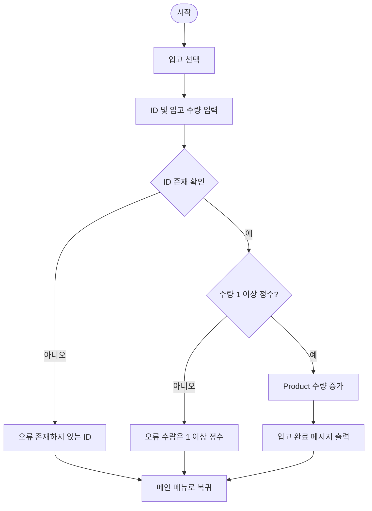
---

### 📤 5️⃣ 출고 (Shipping / Reduce Stock)
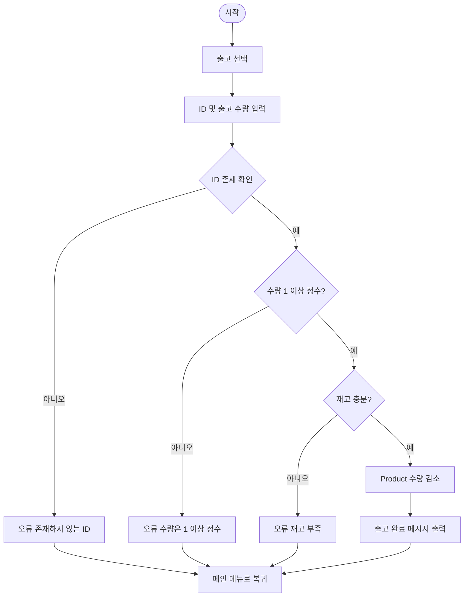

---

### 📋 6️⃣ 목록 보기 (List / Sort / Filter)
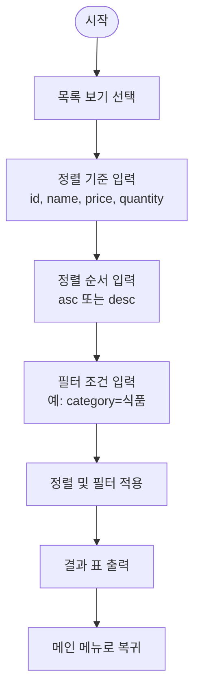
---

### 🔍 7️⃣ 검색 (Search)
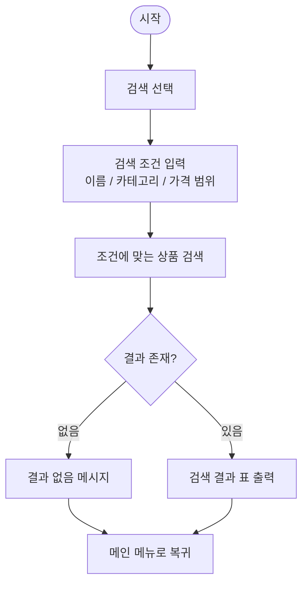
---

### 📊 8️⃣ 통계 (Statistics)
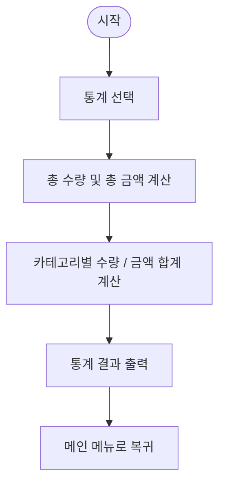

---

### 💾 9️⃣ 저장 및 종료 (Save & Exit)
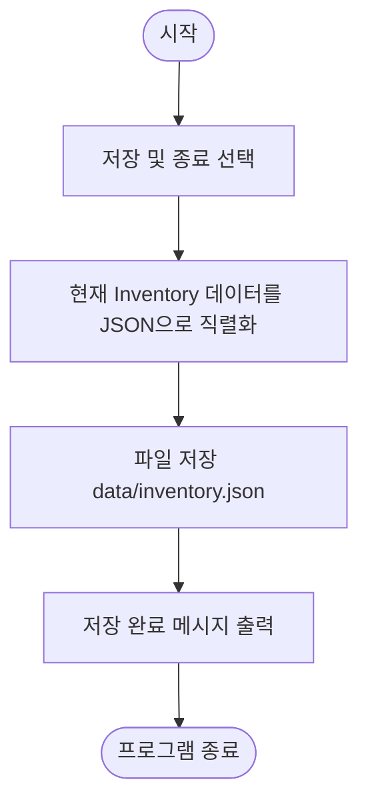
---

### sequence diagram
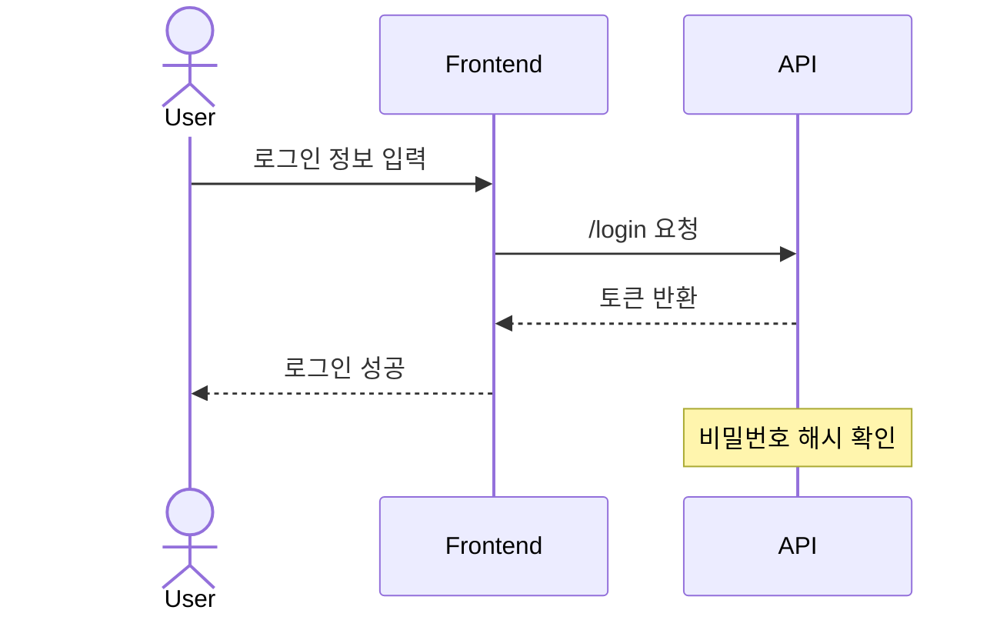

### class diagram
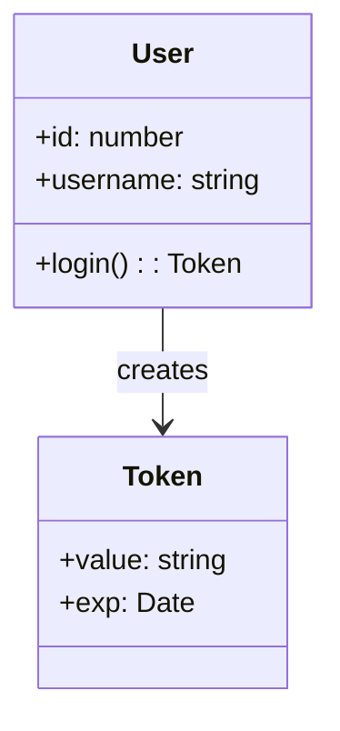

### state diagram
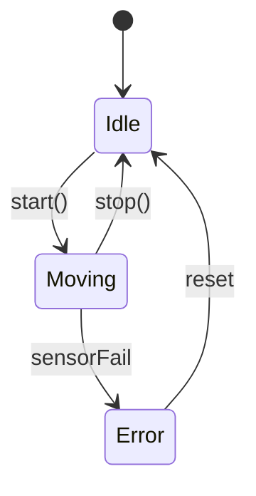

### ERD
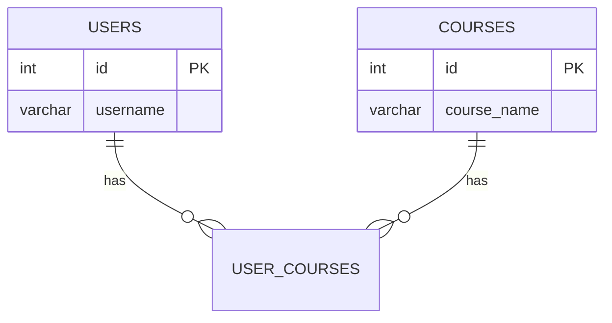

### gantt
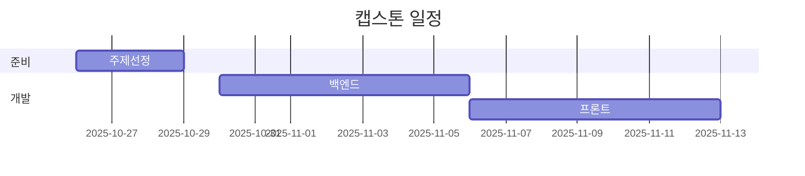

### mind map
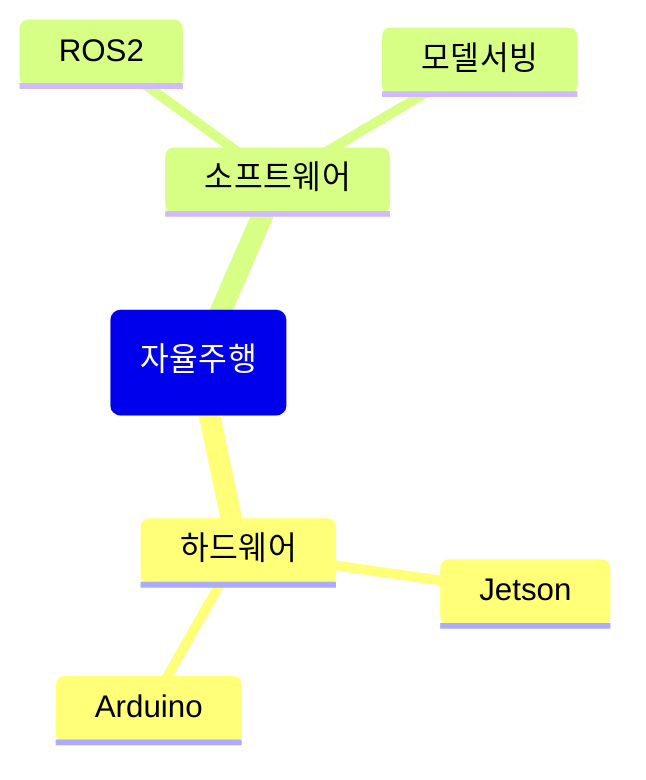